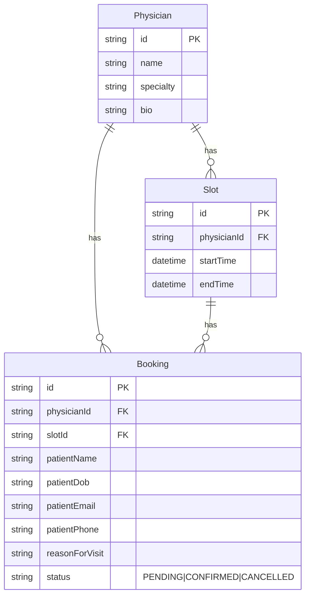

# Patient Booking form

A simple patient appointment booking flow with a clinic admin view, built as a take-home for Vero. The goal was to demonstrate product judgment, code quality, UX, and reliability on a realistic clinical-workflow problem within a tight timebox.

## Quick start

Requires Node.js 20+.

```bash
npm install
npm run dev
```

That's it. `postinstall` runs `prisma generate`, sets up the SQLite schema, and seeds the database with sample physicians, two weeks of slots, and a few example bookings — so the app is ready to use the moment `npm run dev` finishes.

Then open:

- **`http://localhost:3000`** — landing page
- **`http://localhost:3000/book`** — patient booking flow
- **`http://localhost:3000/admin`** — clinic admin view

To reset the database to a clean seeded state at any time: `npm run db:reset`.

## What I built

A single Next.js 15 app with two surfaces and a shared data layer.

### Patient flow (`/book`)

A four-step flow: choose clinician → choose time → enter your details → review and submit. Submitting creates a booking in `PENDING` state; the patient lands on a confirmation screen explaining that the request still has to be confirmed by the clinic.

### Clinic admin (`/admin`)

A bookings table with status filters, clinician filter, expandable rows showing full patient details, and Confirm / Cancel actions. Mobile users see a stacked card layout instead of a table.

### Data model



Slots are pre-generated per physician (weekdays, 9 AM – 5 PM, 30-min intervals, lunch hour skipped, two weeks ahead). Availability is derived: a slot is "available" if it has no active (PENDING or CONFIRMED) booking. Cancelling a booking releases the slot, which is the behavior I'd expect in a real clinic workflow.

## Key technical & product decisions

**Stack: Next.js 15 (App Router) + TypeScript + Prisma + SQLite + Tailwind.** This keeps the entire app in one repo, runnable with `npm install && npm run dev` and zero infrastructure. SQLite means the grader doesn't need Docker, Postgres, or any environment setup. Server actions handle all mutations, which keeps the API surface tight and type-safe end-to-end.

**Booking *request*, not booking.** A new booking starts in `PENDING`, not `CONFIRMED`. The patient confirmation page makes this distinction explicit ("your booking has been requested … the clinic will confirm shortly"). This matches how real clinics actually work and avoids overpromising to patients — a small product call that I think matters in healthcare.

**Status as a state machine.** Transitions are defined in one place (`src/types/index.ts`): `PENDING → CONFIRMED|CANCELLED`, `CONFIRMED → CANCELLED`, `CANCELLED → ∅`. The admin UI hides actions that aren't valid from the current state, and the server action re-validates the transition before writing. Invalid states should be unrepresentable in both the UI and the data layer.

**Slot conflict handling.** Two patients can pick the same slot before either submits. I handle this with a transactional re-check inside `createBooking`: read the slot with its active bookings, fail fast if it's taken, otherwise create. If the conflict happens, the patient is bounced back to step 2 with their form data preserved and a clear message explaining what happened. SQLite's transaction semantics aren't strong enough to fully eliminate the race — see "What I'd improve" below.

**Mobile-first throughout.** Every page works on phone-sized viewports. The booking flow uses a responsive grid for the slot picker and a single-column form layout. The admin table swaps to stacked cards under `md`. Vero's JD called out cross-device behavior, and most patient bookings happen on phones.

**Reason-for-visit treated as PHI.** The form has an explicit reminder ("This information is treated as protected health information"), a sensible character limit, and the demo banner across the entire app makes the non-clinical context unambiguous.

**Server-side validation, twice.** Zod schemas live in `lib/validations.ts` and are reused by the form (for inline errors) and the server action (as the source of truth). Even if the client is bypassed, no malformed booking can be written.

**Custom UI primitives, not generic shadcn.** I wrote thin Button, Input, Label, Textarea, and StatusBadge components with a cohesive editorial look — Fraunces (display) + Geist Sans (body), warm cream + ink + forest accent palette. It signals taste without spending hours on a design system.

## What I'd improve with more time

In rough priority order:

- **Real authentication.** Patient and admin surfaces are wide open in this build. NextAuth with magic-link email for patients and a separate admin scope is the right starting point.
- **Hard slot conflict guarantee.** On Postgres I'd add a partial unique index `CREATE UNIQUE INDEX ON booking (slot_id) WHERE status != 'CANCELLED'`, which makes double-booking impossible at the database level. Or use row-level locking inside the transaction.
- **Audit trail / status history.** A `BookingStatusChange` table recording who changed what when, with reason. Critical for clinical software.
- **Notifications.** Confirmation and reminder emails (Resend or similar), and SMS reminders the day before via Twilio.
- **Reschedule flow.** Right now a patient can only book or cancel; rescheduling means cancel + rebook. A proper reschedule action that releases the old slot and acquires a new one in one transaction.
- **Physician availability management.** An admin page to mark slots unavailable, define standard schedules, block off vacation time.
- **Tests.** Unit tests for the state machine and validation, integration tests for the booking flow against a test SQLite database.
- **Accessibility audit.** Form labels and focus management are in place, but I'd run axe and verify keyboard navigation through the entire booking flow.
- **Observability.** Even a structured `console.log` with request IDs, plus a Sentry hookup for errors.
- **Internationalization & timezone correctness.** All dates currently render in the browser's locale and timezone, which is fine for a single-clinic demo but breaks the moment you have a multi-region patient base.

## A note on healthcare context

Clinical software has a different bar than consumer software: a wrong date on a coffee order is annoying, a wrong date on a colonoscopy is a real-world problem. I tried to reflect that in small choices throughout — explicit demo-only banner, treating reason-for-visit as PHI, distinguishing requests from confirmed bookings, modelling status as a state machine, validating server-side regardless of the client. None of this is groundbreaking; it's just being deliberate about the context.

## Project structure

```
patient-booking/
├── prisma/
│   ├── schema.prisma     # Physician, Slot, Booking
│   └── seed.ts           # 4 physicians, 2 weeks of slots, 3 sample bookings
├── src/
│   ├── actions/          # Server actions (booking CRUD, physicians)
│   ├── app/
│   │   ├── page.tsx      # Landing
│   │   ├── book/         # Patient flow + confirmation
│   │   └── admin/        # Clinic admin
│   ├── components/
│   │   ├── ui/           # Button, Input, StatusBadge, etc.
│   │   ├── booking-flow.tsx
│   │   ├── admin-table.tsx
│   │   └── demo-banner.tsx
│   ├── lib/
│   │   ├── db.ts         # Prisma singleton
│   │   ├── utils.ts      # cn(), date formatters
│   │   └── validations.ts # Zod schemas
│   └── types/index.ts    # BookingStatus + state machine
├── tailwind.config.ts
└── README.md
```
