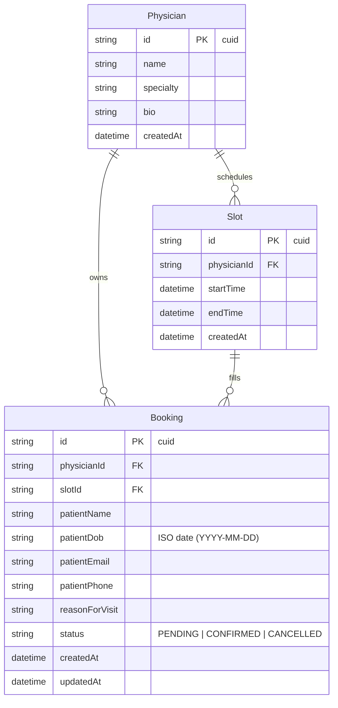

# Apex Health: Patient Booking

**Live demo:** https://patient-booking-jaitrarewar.vercel.app · admin password: `demo-admin-2026`

[](https://codespaces.new/jaitra-rewar4/patient-booking)

Apex Health is a patient booking app for a fictional clinic. Patients pick a clinician, choose an open time, enter their details, and submit. Clinic staff see the request in an admin panel and confirm or cancel from there. The whole thing is one Next.js app with a Prisma schema, SQLite locally, and Turso in production.

## Quick start

### Open in your browser (no install)

Click the **Open in GitHub Codespaces** badge above. GitHub spins up a Linux VM in your browser, installs dependencies (~30s), and auto-opens the running app on port 3000. The badge does everything end-to-end (`prisma generate`, `db push`, seed, `npm run dev`) via the `.devcontainer` config in this repo. You need a GitHub account, and the free Codespaces tier gives 60 hours per month.

### Run locally

Requires Node.js 20+.

```bash
npm install
npm run dev
```

The `postinstall` script runs `prisma generate`, sets up the SQLite schema, and seeds the database with sample physicians, two weeks of slots, and a few example bookings, so the app is ready to use the moment `npm run dev` finishes.

Then open:

- **`http://localhost:3000`**: landing page
- **`http://localhost:3000/book`**: patient booking flow
- **`http://localhost:3000/admin`**: clinic admin view (gated by password)

The admin password is in `.env`: `ADMIN_PASSWORD=demo-admin-2026`. Visiting `/admin` redirects to a login page. Once signed in you stay logged in for 24 hours via a signed cookie.

To reset the database to a clean seeded state at any time: `npm run db:reset`.

## What I built

A single Next.js 15 app with two surfaces and a shared data layer.

### Patient flow (`/book`)

A four-step flow: choose clinician → choose time → enter your details → review and submit. Submitting creates a booking in `PENDING` state. The patient lands on a confirmation screen explaining that the request still has to be confirmed by the clinic.

### Clinic admin (`/admin`)

A bookings table with status filters, clinician filter, debounced patient-name search, and four small stat cards across the top (Pending, Confirmed, Today, This week). Clicking a row on desktop opens a dialog with full patient details, Confirm / Cancel actions, and an inline email-preview toggle. Mobile users get a stacked card layout with the same actions inline. Action results surface as toasts rather than an inline error banner.

The `/admin` route is gated by a single shared staff password, a deliberately lightweight stand-in for real auth (see "Scope choices" below).

### Confirmation page (`/book/confirm`)

After submitting, patients land on a confirmation page that animates a check-in mark, recaps the request, and shows an **email preview**: a styled mockup of what the confirmation email would look like in production. No email is actually sent.

### Data model



**Notation.** `PK` (primary key, the row's unique identifier). `FK` (foreign key, points to another table's PK). `cuid` (collision-resistant unique identifier; Prisma's default ID format, a 25-character URL-safe string like `cmoyvlj2m00fpvytlnruurigu`, not a sequential integer. Harder to enumerate via guessable URLs).

**Indexes.** `Slot(physicianId, startTime)` for fast availability lookups; `Booking(physicianId, status)` and `Booking(slotId, status)` for the admin filters and the slot-conflict re-check inside `createBooking`.

**Invariant.** A Slot can have many historical Bookings (cancelled ones), but at most one in `PENDING` or `CONFIRMED` at a time. The state machine plus the transactional re-check in `createBooking` enforce this in code. In Postgres I would back it up with a partial unique index `ON Booking(slotId) WHERE status != 'CANCELLED'`.

**Generation.** Slots are pre-seeded per physician (weekdays, 9 AM to 5 PM, 30-minute intervals, lunch hour skipped, two weeks ahead). Availability is derived: a slot is "available" if it starts in the future and has no `PENDING` or `CONFIRMED` booking. Cancelling a booking releases the slot.

**Why dates as ISO strings for DOB.** Date-only fields (birthdays) should not carry a timezone. Storing as `"1992-11-08"` avoids the off-by-one-day bugs that come from a `DateTime` in UTC rendering as the previous day in a negative-offset timezone.

## Key technical & product decisions

**Stack: Next.js 15 (App Router) + TypeScript + Prisma + SQLite + Tailwind.** This keeps the entire app in one repo, runnable with `npm install && npm run dev` and zero infrastructure. SQLite means the grader does not need Docker, Postgres, or any environment setup. Server actions handle all mutations, which keeps the API surface tight and type-safe end-to-end.

**Booking *request*, not booking.** A new booking starts in `PENDING`, not `CONFIRMED`. The patient confirmation page makes this distinction explicit ("your booking has been requested … the clinic will confirm shortly"). Clinics work this way in practice, and it keeps the app from over-promising to a patient before staff have verified the slot.

**Status as a state machine.** Transitions are defined in one place (`src/types/index.ts`): `PENDING → CONFIRMED|CANCELLED`, `CONFIRMED → CANCELLED`, `CANCELLED → terminal`. The admin UI only shows the buttons for legal transitions. Even so, the server action revalidates before writing, so a client posting a bogus status change cannot push the DB into a bad state.

**Slot conflict handling.** Two patients can pick the same slot before either submits. I handle this with a transactional re-check inside `createBooking`: read the slot with its active bookings, fail fast if it is taken, otherwise create. If the conflict happens, the patient is bounced back to step 2 with their form data preserved and a clear message explaining what happened. SQLite's transaction semantics are not strong enough to fully eliminate the race (see "What I would improve" below).

**Mobile-first throughout.** Every page works on phone-sized viewports. The booking flow uses a responsive grid for the slot picker and a single-column form layout. The admin table swaps to stacked cards under `md`.

**Reason-for-visit treated as PHI.** The form has an explicit reminder ("This information is treated as protected health information"), a sensible character limit, and the demo banner across the entire app makes the non-clinical context unambiguous.

**Server-side validation, twice.** Zod schemas live in `lib/validations.ts` and are reused by the form (for inline errors) and the server action (as the source of truth). Even if the client is bypassed, no malformed booking can be written.

**Custom UI primitives, not generic shadcn.** Thin Button, Input, Label, Textarea, and StatusBadge components built directly on Tailwind, with an editorial palette (Fraunces for display, Geist Sans for body, warm cream/ink/forest). Faster than building a real design system from scratch, and the result looks more intentional than dropping in shadcn's defaults. Two Radix primitives are in the mix, themed to match the rest: Dialog (the desktop booking detail) and Toast (admin action feedback).

**Scope choices: lightweight auth and email preview.** Real auth and real transactional email each take a real amount of time to do well, and half-implementations of either tend to introduce more bugs than they solve. So instead: a single shared staff password on `/admin` (HMAC-SHA256 cookie signed with Web Crypto, runs in middleware, ~200 LOC, no auth library) and an inline email preview that renders the design on `/book/confirm` and inside the admin booking dialog but never actually sends. Patient routes stay open. A production version would swap the gate for SSO with per-staff roles, and the preview for Resend with templated transactional sends.

## What I would improve with more time

In rough priority order:

- **Real authentication.** The current admin gate is a single shared password, fine for a demo but not for production. Real version: SSO (Google Workspace or Okta) for clinic staff with per-user accounts and roles (front-desk vs. clinician vs. admin), and magic-link email for patients with their own bookings dashboard. Patient surfaces are intentionally open in this build.
- **Hard slot conflict guarantee.** On Postgres I would add a partial unique index `CREATE UNIQUE INDEX ON booking (slot_id) WHERE status != 'CANCELLED'`, which makes double-booking impossible at the database level. Or use row-level locking inside the transaction.
- **Audit trail / status history.** A `BookingStatusChange` table recording who changed what when, with reason. Critical for clinical software.
- **Real notifications.** The email preview shows the design but nothing is delivered. The production pipeline would fire on four events (request received, request confirmed, day-before reminder, cancellation) through a `sendBookingEmail(booking, kind)` server function that picks the matching React Email template, renders to HTML, and posts to Resend (or SES). Templates would live next to `email-preview.tsx` so the in-app preview and the real email stay one-to-one as the design evolves. Optional layer on top: a Claude call that adjusts the message body to the patient's reason-for-visit, with a gentler tone for chronic-condition follow-ups and more practical logistical detail for routine visits. SMS reminders the day before via Twilio.
- **Reschedule flow.** Right now a patient can only book or cancel. Rescheduling means cancel + rebook. A proper reschedule action would release the old slot and acquire a new one in a single transaction.
- **Physician availability management.** An admin page to mark slots unavailable, define standard schedules, and block off vacation time.
- **Tests.** Unit tests for the state machine and validation, integration tests for the booking flow against a test SQLite database.
- **Accessibility audit.** Form labels and focus management are in place, but I would run axe and verify keyboard navigation through the entire booking flow.
- **Observability.** Even a structured `console.log` with request IDs, plus a Sentry hookup for errors.
- **Internationalization and timezone correctness.** All dates currently render in the browser's locale and timezone, which is fine for a single-clinic demo but breaks the moment you have a multi-region patient base.

### Use cases the demo does not cover yet

The five requirements in the brief land me at "patient picks a single appointment from open slots." Real clinical scheduling has more shape than that. The features I would build next, roughly in the order I would prioritise them:

- **Recurring / series appointments.** Chronic-care follow-ups (physio, oncology, mental health) typically book in a series, such as weekly for N weeks or monthly for N months. One form, one click, one `seriesId` linking the resulting `bookings` so cancelling or rescheduling can act on the whole series.
- **Multiple appointment types and durations.** A new-patient intake is 60 minutes, a routine follow-up is 15, a procedure is 90. Slots become elastic: either each slot carries its own `durationMinutes` per appointment type, or a 60-minute booking consumes two adjacent 30-minute slots in one transaction. The patient picks the appointment type up front so the slot picker shows only viable times.
- **Telehealth vs in-person.** Patient picks a modality. Telehealth bookings drop the address fields and include a join link (Zoom or Doxy.me) in the confirmation. Admin filters by modality. Physicians flag which modalities they offer per appointment type.
- **Returning-patient entity.** Today every booking creates a fresh patient record. The real model has a `Patient` table keyed by email plus phone (or full SSO identity once auth lands), linked to many Bookings. Second-visit form pre-fills, and the admin row can show "3rd visit this year", useful context for clinic staff.
- **Waitlist for fully-booked clinicians.** When a physician has no open slots, the patient opts onto a waitlist. On any cancellation, the system offers the freed slot to the first waitlisted patient with a 15-minute claim window before moving down the list.
- **Pre-visit intake forms.** Reason-for-visit becomes the first field in a fuller, specialty-aware intake (allergies, current medications, symptom timeline). Pediatrics asks different questions than dermatology. The structured data feeds the clinician's pre-visit prep, and in the Vero direction it becomes input for AI-assisted clinical-note generation downstream.
- **Walk-in / urgent overlay.** Some clinics need a queue for same-day walk-ins running parallel to scheduled appointments. The admin sees both streams; the patient-facing flow does not change.
- **Cancellation policy enforcement.** Late-cancel (under 24 hours) and no-show flags on bookings, with a per-clinic policy (warning, fee, account note). Important for clinic operations but lives entirely in admin land.

## A note on healthcare context

Healthcare apps fail differently from consumer apps. A wrong date in a calendar app is a nuisance. A wrong date on a clinic appointment cascades into missed care, frustrated patients, and reschedule overhead. The PHI reminder on the reason-for-visit field, the persistent demo banner, the request-versus-confirmation distinction, and the server-side revalidation are not anything novel. These are the defaults I wanted in place for an app in this domain.

## Project structure

```
patient-booking/
├── .devcontainer/
│   └── devcontainer.json       # One-click GitHub Codespaces setup
├── prisma/
│   ├── schema.prisma           # Physician, Slot, Booking
│   └── seed.ts                 # 4 physicians, 2 weeks of slots, 3 sample bookings
├── scripts/
│   ├── postinstall.mjs         # Runs prisma generate always; skips local db push + seed on Vercel/CI
│   └── apply-turso-schema.mjs  # One-off: push the Prisma-derived SQL schema to Turso
├── src/
│   ├── actions/                # Server actions
│   │   ├── auth.ts             # Sign-out
│   │   ├── bookings.ts         # Read, create with slot-conflict re-check, status transitions
│   │   └── physicians.ts
│   ├── app/
│   │   ├── page.tsx            # Landing
│   │   ├── layout.tsx          # Fonts + metadata
│   │   ├── not-found.tsx
│   │   ├── book/               # Patient flow + confirmation (with email preview)
│   │   └── admin/              # Clinic admin (gated by middleware)
│   │       └── login/          # Password gate
│   ├── components/
│   │   ├── ui/                 # Button, Input, StatusBadge, Dialog, Toast, SubmitButton
│   │   ├── booking-flow.tsx
│   │   ├── admin-table.tsx
│   │   ├── avatar.tsx          # Deterministic-color physician avatar
│   │   ├── email-preview.tsx   # Confirmation email mockup
│   │   └── demo-banner.tsx
│   ├── lib/
│   │   ├── db.ts               # Prisma singleton
│   │   ├── prisma-client.ts    # Conditional adapter: local SQLite vs Turso (libSQL)
│   │   ├── utils.ts            # cn(), date formatters
│   │   ├── validations.ts      # Zod schemas
│   │   └── auth.ts             # HMAC-SHA256 session sign/verify (Web Crypto)
│   ├── middleware.ts           # /admin gate, redirects to /admin/login
│   └── types/index.ts          # BookingStatus + state machine
├── tailwind.config.ts
└── README.md
```
